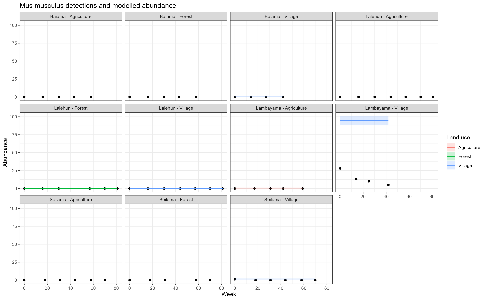
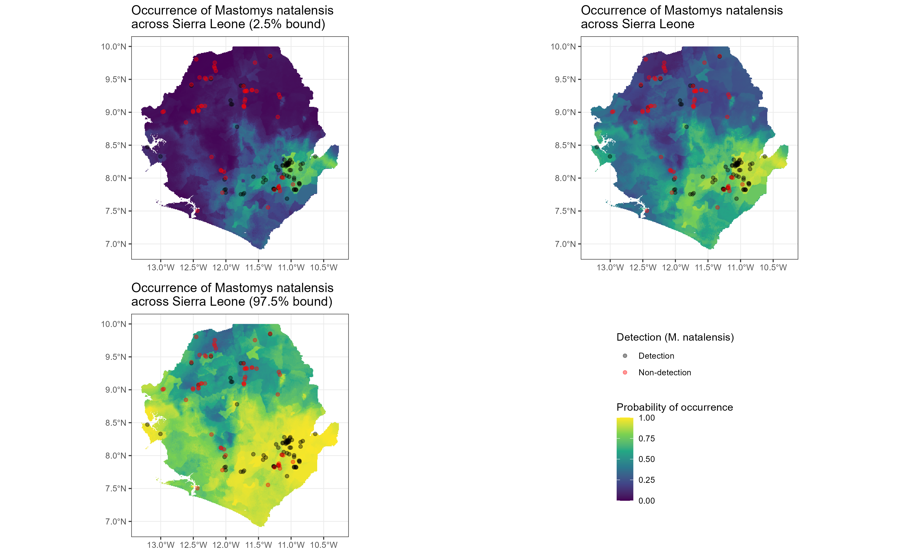

# Chapter 5

This repository will accompany the final chapter of my thesis. I am currently exploring two options for what this will be.

1. A population dynamic model of different rodent species across time in Eastern Sierra Leone.
2. A joint Species-Distribution Model of rodent species probability of occurrence in different landuse types in Eastern Sierra Leone.

## Population dynamic model

### Motivation

The risk of Lassa Fever spillover into human populations is a function of hazard (from rodent and pathogen prevalence) and exposure to the hazard. To better understand hazard and exposure quantifying the number of rodents existing within a landscape could be beneficial. Multiple rodent species exist within these landscapes, often competing for limited resources. Population dynamics are therefore likely intertwined between different rodent species. Using capture data is it possible to estimate the number of individuals within a defined location and model relative population changes?

### Approach

Produce a mathematical model of population dynamics trained on capture data from trapping sessions for each species. The model will be used to estimate recruitment rates to identify whether birth pulses exist in this region and how they may compare to studies in other regions using CMR data where these are better able to be estimated. Mortality rates of species will be set based on literature values. 

### Data sources and relevant links

1. Capture data for each species.
2. Probability of detection extracted from Chapter 3.
3. Landuse data.
4. Weather data.

### Timeline

I will need to review population modelling in "open" systems in the absence of CMR data which is typically used for these approaches. 

The first step is to process observed data to model abundance accounting for imperfect detection. There are several approaches to this. One supported by [unmarked](https://rbchan.github.io/unmarked/reference/index.html) appears to be able to model dynamics and derive recruitment and survival rates. Two papers that may be helpful to understand this are [Hostetler and Chandler, 2015](https://doi.org/10.1890/14-1487.1) and [Dail and Madsen, 2011](https://doi.org/10.1111/j.1541-0420.2010.01465.x). 

An early approach has been to adopt the N-mixture model of [Royle, 2004](https://doi.org/10.1111/j.0006-341X.2004.00142.x) to produce a site level abundance measure from spatially replicated count data.

Following this it may be useful to compare this to a mathematical model using parameters estimated from the literature for different species and compare the two approaches to estimating population dynamics.

## Species distribution model

### Motivation

This approach will focus on the exposure to the potential hazard. How many individuals in Eastern Sierra Leone are potentially exposed to species that may be hosts of Lassa Fever. Using rodent trapping data can the occurrence of different species be modelled across space based on land use type in a multi-species framework.

### Approach

Several modelling approaches could be used. The SDM can be formulated as a BRT or GAM.

### Resources

1. Capture data for each species.
2. Probability of detection extracted from Chapter 3.
3. Landuse data.
4. Weather data.
5. Non detection data produced from GBIF [download](https://doi.org/10.15468/dl.7uwp4w)

### Timeline

I will need to review SDMs and identify the most suitable approach for this data. There is no clear best approach to take for this and it would be beneficial to adopt several approaches and compare the outputs using sensitivity analyses.

